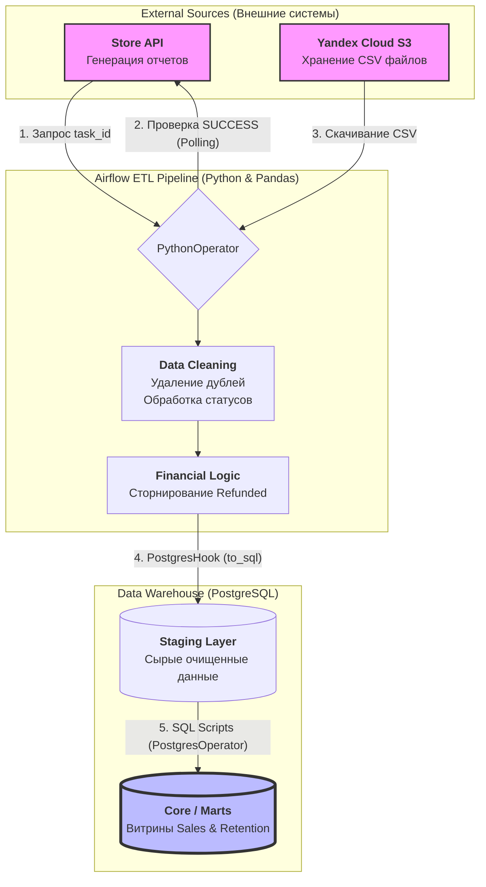

# Автоматизация ETL-пайплайна: Интеграция API и расчет витрин

## Описание проекта
Проект посвящен разработке отказоустойчивого пайплайна данных для интернет-магазина. Основная задача заключалась в автоматизации ежедневного сбора данных о продажах из внешнего API, их очистке и трансформации в аналитические витрины.

**Ключевые этапы работы:**
*   **Сбор данных**: Airflow обращается к API магазина, дожидается формирования отчета и получает ссылку на файл в S3.
*   **Обработка возвратов**: Python-скрипт скачивает файл, с помощью Pandas удаляет дубликаты и корректирует суммы для возвратов (статус refunded).
*   **Загрузка и расчет**: Данные сохраняются в таблицы Staging, после чего SQL-скрипты обновляют итоговые витрины продаж и удержания клиентов.


## Архитектура и поток данных

Проект реализует классический цикл обработки данных от внешних облачных систем до финальной бизнес-аналитики:




## Архитектура и поток данных

Пайплайн настроен на последовательную обработку данных от внешнего источника до финальных витрин:


```text
 [ Внешнее API ] ───► [ S3 Хранилище ] ───► [ Python/Pandas ] ───► [ PostgreSQL ]
 (Запрос отчета)      (CSV файлы)          (Очистка данных)       (Витрины данных)


Сбор данных: Airflow обращается к API магазина, дожидается формирования отчета и получает ссылку на файл в S3.
Обработка (ETL): Python-скрипт скачивает файл, с помощью Pandas удаляет дубликаты и корректирует суммы для возвратов (статус refunded).
Загрузка и расчет: Данные сохраняются в таблицы Staging, после чего SQL-скрипты обновляют итоговые витрины продаж и удержания клиентов.
```

## Навыки и инструменты

### Python и Airflow (Оркестрация)
* **Apache Airflow**: Написание базовых DAG, использование PythonOperator и PostgresOperator. Настройка передачи данных между задачами через XCom.
* **Работа с API**: Написание запросов к REST API (библиотека requests), обработка JSON-ответов и ожидание готовности данных (циклы со sleep).
* **Pandas**: Базовая очистка данных — удаление дублей (drop_duplicates), добавление недостающих колонок и замена значений по условию.

### SQL и Хранилища данных
* **PostgreSQL**: Работа со слоями данных (загрузка в staging и последующий расчет витрин).
* **SQL-запросы**: Использование JOIN, CASE WHEN, UNION ALL и агрегатных функций. Работа с CTE для расчета метрик.
* **Проектирование витрин**: Создание таблиц для анализа продаж и базовых метрик удержания клиентов (количество новых и вернувшихся покупателей).


## Общий вывод
В ходе выполнения проекта выполнена загрузка данных из внешнего API и их трансформация в удобный для анализа вид.
Главным итогом работы стало создание инкрементального пайплайна, который корректно обрабатывает возвраты товаров и позволяет еженедельно обновлять отчет по поведению клиентов.
