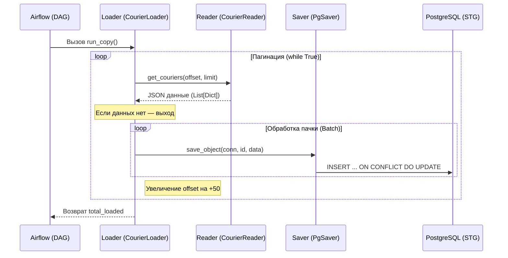
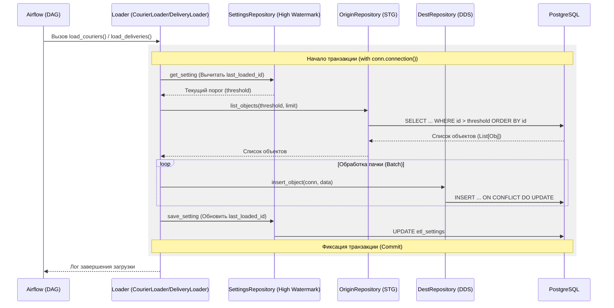

# Построение DWH и автоматизация расчетов с курьерами

## Описание проекта
Данный проект направлен на построение многослойного хранилища данных (DWH) для автоматизации расчета ежемесячных выплат курьерам. Основная задача заключалась в том, чтобы собрать данные из внешнего API службы доставки, объединить их с уже имеющимися данными о заказах и подготовить итоговую финансовую витрину.


**Что было сделано в проекте:**
*   **Сбор данных**: Настройка загрузки данных из внешнего API (справочники курьеров и лог доставок).
*   **Обработка расчетов**: Реализация логики начислений, которая зависит от рейтинга курьера, чаевых и комиссии платформы.
*   **Многослойная структура**: Организация данных по трем слоям (STG, DDS, CDM) для обеспечения порядка и чистоты в базе.

---

## Архитектура и поток данных

В проекте реализован классический путь данных от источника до отчетности:

```text
 [ API Доставки ] ──► [ STG: Сырые данные ] ──► [ DDS: Интеграция ] ──► [ CDM: Витрина ]
 (Загрузка в JSON)    (Буферный слой)          (Связывание таблиц)      (Расчет выплат)

Слой STG: С помощью Airflow данные из API выгружаются «как есть» в формате JSONB. Для больших объемов использовано постраничное чтение.
Слой DDS: Данные очищаются и раскладываются по нормализованным таблицам. Здесь я связал информацию о доставках с заказами и курьерами.
Слой CDM: На этом этапе рассчитываются финальные суммы к выплате с учетом правил компании (бонусы за рейтинг, чаевые, удержание комиссий).
```


### Взаимодействие компонентов (ETL Logic)






## Навыки и инструменты

### Python и Airflow (ETL-процессы)
*   **Работа с Airflow**: Использование TaskFlow API (`@dag`, `@task`) для создания цепочек задач. Настройка расписания и зависимостей между этапами загрузки.
*   **Интеграция с API**: Разработка Python-скриптов для выгрузки данных через REST API с применением пагинации (`limit` и `offset`).
*   **Обработка данных**: Использование библиотек `requests` и `pydantic` для получения и валидации данных перед загрузкой в базу.

### SQL и Проектирование DWH
*   **Моделирование**: Практика проектирования таблиц в разных слоях хранилища на основе схемы «Снежинка».
*   **Написание запросов**: Применение `JOIN`, `CTE` и логики `CASE WHEN` для реализации формул вознаграждения.
*   **Целостность данных**: Использование ограничений (`Constraints`), уникальных ключей и механизмов `ON CONFLICT` (Upsert) для защиты от дубликатов при повторных запусках пайплайна.


## Общий вывод
В ходе выполнения проекта закреплены навыки построения полноценного ETL-цикла: от извлечения данных из внешних источников до создания готовой бизнес-витрины. 
Удалось отработать механизмы инкрементальной загрузки данных, методы связывания информации из разных систем и перевод бизнес-требований (формул расчета выплат) на язык SQL. Проект позволил на практике изучить устройство многослойных хранилищ и способы обеспечения стабильности пайплайнов в Apache Airflow.
