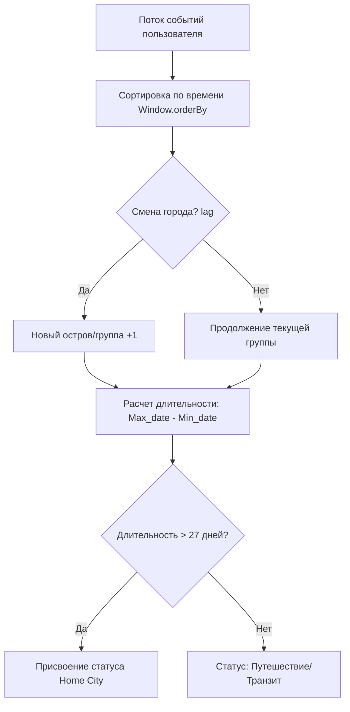

# Базовая геоаналитика в Data Lake (PySpark & Airflow)

## Описание проекта
В рамках этого учебного проекта реализован процесс обработки логов событий социальной сети, хранящихся в **Hadoop (HDFS)**. Основная задача заключалась в том, чтобы научиться работать с географическими координатами пользователей и рассчитывать простые метрики вовлеченности на больших объемах данных с помощью **Apache Spark**.

**Что было сделано в ходе проекта:**
*   **Обработка координат**: Расчет расстояний от сообщений пользователей до ближайших городов Австралии.
*   **Определение локаций**: Попытка выделить «домашний город» пользователя на основе длительности его пребывания в одной точке (более 27 дней).
*   **Система рекомендаций**: Реализация простого алгоритма поиска потенциальных друзей, которые находятся в радиусе 1 км и имеют общие интересы (подписки на каналы).
*   **Автоматизация**: Сборка написанных Spark-скриптов в единую цепочку задач (DAG) в Airflow.


## Архитектура и поток данных

Проект построен по принципу постепенной трансформации данных внутри Data Lake:

```text
 [ HDFS Raw ] ──► [ PySpark Скрипты ] ──► [ HDFS Analytics ] ──► [ Airflow DAG ]
 (Сырые логи)      (Расчеты и Join-ы)     (Итоговые витрины)     (Запуск по расписанию)
```

1. **Загрузка**: Данные о событиях и справочник городов Австралии вычитываются из HDFS.
2. **Гео-фильтрация**: Для каждого сообщения вычисляется расстояние до центров городов (использовалась формула гаверсинуса).
3. **Агрегация**: Данные группируются по неделям и месяцам для подсчета количества сообщений, реакций и регистраций в каждом городе.
4. **Оркестрация**: Запуск расчетов автоматизирован через SparkSubmitOperator в Airflow.


## 📊 Архитектура и поток данных

Проект построен по принципу постепенной трансформации данных внутри Data Lake:

1. **Загрузка**: Данные о событиях и справочник городов Австралии вычитываются из HDFS.
2. **Гео-фильтрация**: Для каждого сообщения вычисляется расстояние до центров городов (использовалась формула гаверсинуса).

### Алгоритм определения Home City (Gaps & Islands)
Для идентификации места жительства пользователя реализована логика отслеживания непрерывных интервалов пребывания в одной локации:


3. **Агрегация**: Данные группируются по неделям и месяцам для подсчета количества сообщений, реакций и регистраций в каждом городе.
4. **Оркестрация**: Запуск расчетов автоматизирован через SparkSubmitOperator в Airflow.


## Навыки и инструменты

### Работа с Big Data (PySpark & HDFS)
* **Основы PySpark**: Практика использования Spark-трансформаций для фильтрации и объединения таблиц. Работа с оконными функциями (Window) для анализа последовательности событий.
* **Гео-данные**: Применение математических функций в Spark для вычисления расстояний между координатами.
* **HDFS**: Загрузка файлов и сохранение результатов в оптимизированном формате Parquet с использованием партиционирования.

### Оркестрация (Airflow)
* **Автоматизация**: Настройка DAG для последовательного запуска Spark-приложений.
* **Управление ресурсами**: Знакомство с параметрами запуска задач на кластере (настройка памяти и ядер для экзекуторов).


## Общий вывод
В ходе проекта удалось на практике познакомиться с инструментами Big Data. Были изучены базовые принципы работы Apache Spark: как читать данные из распределенной системы, как связывать большие таблицы между собой и как автоматизировать эти процессы.
Самым сложным этапом стала реализация логики «домашнего города» и расчет расстояний, что потребовало разбора работы оконных функций и математических формул внутри Spark. Проект помог понять общую структуру Data Lake и то, как распределенные вычисления ускоряют обработку миллионов строк данных.


# Проект 7-го спринта

### Описание
Репозиторий предназначен для сдачи проекта 7-го спринта

### Как работать с репозиторием
1. В вашем GitHub-аккаунте автоматически создастся репозиторий `de-project-sprint-7` после того, как вы привяжете свой GitHub-аккаунт на Платформе.
2. Скопируйте репозиторий на свой компьютер. В качестве пароля укажите ваш `Access Token`, который нужно получить на странице [Personal Access Tokens](https://github.com/settings/tokens)):
	* `git clone https://github.com/{{ username }}/de-project-sprint-7.git`
3. Перейдите в директорию с проектом: 
	* `cd de-project-sprint-7`
4. Выполните проект и сохраните получившийся код в локальном репозитории:
	* `git add .`
	* `git commit -m 'my best commit'`
5. Обновите репозиторий в вашем GutHub-аккаунте:
	* `git push origin main`

### Структура репозитория
Вложенные файлы в репозиторий будут использоваться для проверки и предоставления обратной связи по проекту. Поэтому постарайтесь публиковать ваше решение согласно установленной структуре — так будет проще соотнести задания с решениями.

Внутри `src` расположены две папки:
- `/src/dags`;
- `/src/sql`.
